# Linux and Windows Virtual Lab

Name: Lubna Rabia   

Date: September 14, 2026

Course :Introduktion till yrkesrollen och grunderna i IT-infrastruktur (ISCX26, Chas Academy)

## 1. Introduction.

Description:

This project documents a virtual lab containing an Ubuntu

Linux server and a Windows client connected through a

shared virtual network. Two virtual machines were created using VirtualBox:

A Linux server running Ubuntu Server.

A Windows client running Windows 11.

Both virtual machines were connected to the same internal network in VirtualBox.

## 2. Lab Environment and Network

| Hostname       | Operating System | IP Address   | Subnet Mask   | Default Gateway |
| -------------- | ---------------- | ------------ | ------------- | --------------- |
| admin-virtualbox   | ubuntu 26.04 LTS    | 192.168.10.10 | 255.255.255.0 | —               |
| windows-client | Windows 11       | 192.168.10.20 | 255.255.255.0 | —               |


## Network Configuration

Network name: LabNetwork

Network type: Internal Network

Both virtual machines use the same internal network and can therefore communicate with each other.

## Ubuntu Server

The Ubuntu Server was configured with a static IP address.

Hostname: admin-virtualbox

IP Address: 192.168.10.10

Subnet Mask: 255.255.255.0

Default Gateway: None

## Linux Network Configuration

The Linux virtual machine was configured as part of the virtual lab network.

The main network interface was identified as enp0s3. The interface was active (UP), which means that the virtual network adapter was enabled and connected.

## Checking the Netplan Configuration

The available Netplan configuration files were checked using:

```bash
ls /etc/netplan/
```
The following files were present:

01-network-manager-all.yaml

50-cloud-init.yaml

50-cloud-init.yaml.save

The Netplan configuration was then opened for editing using:

```bash
sudo nano /etc/netplan/50-cloud-init.yaml
```
The network configuration was edited to configure the Linux virtual machine for the internal lab network.

## Applying the Network Configuration

After editing the configuration, the changes were applied using:

```bash
sudo netplan apply
```
Netplan displayed a warning stating that the permissions for the configuration file were too open:

Permissions for /etc/netplan/50-cloud-init.yaml are too open.

Netplan configuration should NOT be accessible by others.

This is a file-permission warning. It means that the Netplan configuration file has permissions that are more open than recommended. The warning does not necessarily mean that the network configuration failed.

## Network Interface

The main network interface used by the Linux virtual machine was:

enp0s3, The interface was shown as :UP, which indicates that the virtual network adapter was active.

## Verification

The IPv4 configuration can be verified using:

```bash
ip -4 addr
```
The expected configuration for this lab is:

IP address: 192.168.10.10

Subnet mask: 255.255.255.0 (/24)

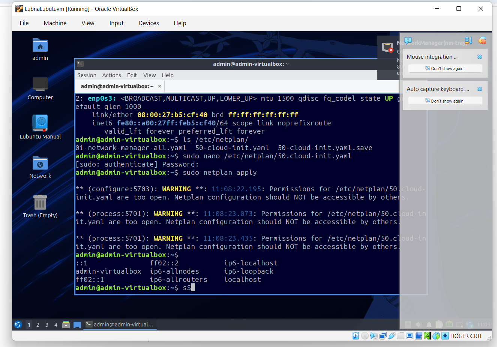

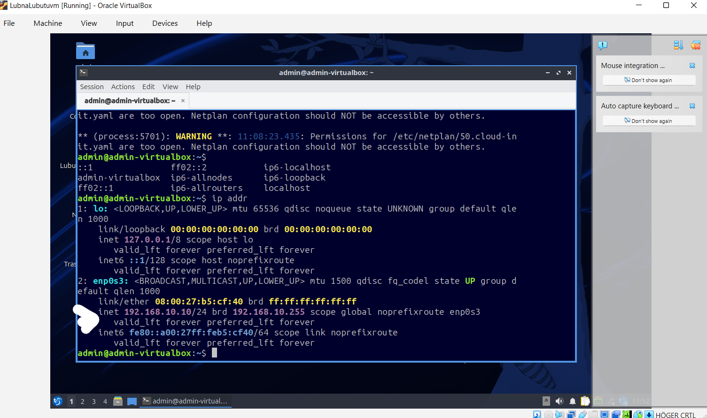

## Windows Client

The Windows client was configured with a static IP address.

Hostname: Windows-Client

IP Address: 192.168.10.20

Subnet Mask: 255.255.255.0

Default Gateway: None

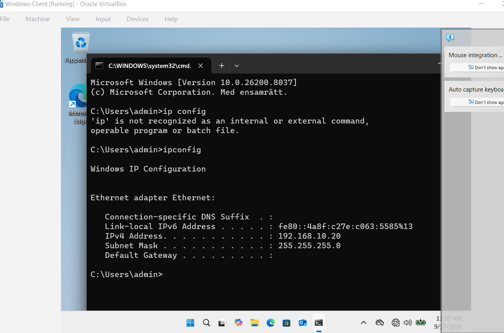

## Problem

when I tried to ping from ubuntu it a says ping 192.168.10.20 56(84) bytes of data and its running nothing else which meant Ubuntu is sending the ping but not receiving a reply. I then did it manually first open windows firewall , open advanced settings, create an inbound rule. 

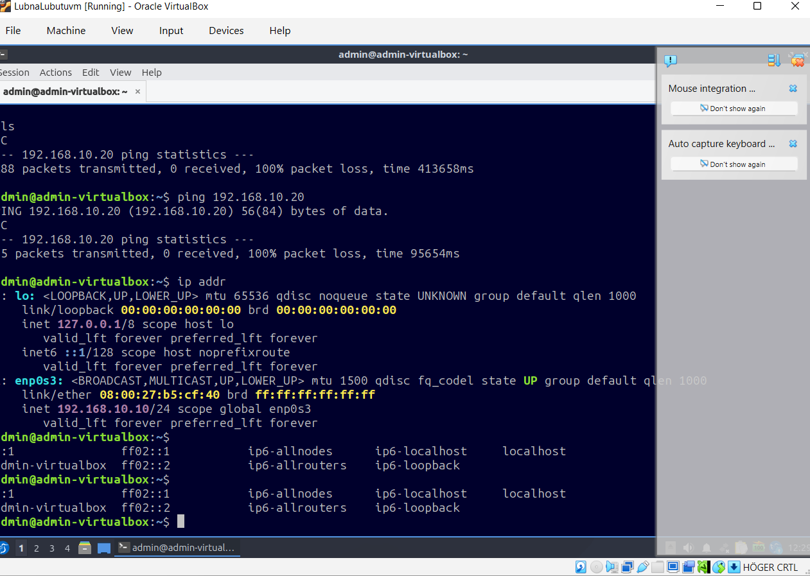

## Create a specific rule for ping

In the New Inbound Rule Wizard:

Select Custom → Next.

Select All programs → Next.

Under Protocol type, select ICMPv4.

Click Customize… next to ICMP settings.

Select Specific ICMP types, then check Echo Request.

Click OK → Next.

Select Any IP address for both local and remote IP addresses → Next.

Select Allow the connection → Next.

Check the profiles you need. For your isolated lab, select Private (and Domain if applicable). If your network is classified as Public, you can select Public too, but only if needed.

Name the rule Allow Ubuntu Ping → Finish.

This allows Windows to respond to ping requests from Ubuntu.

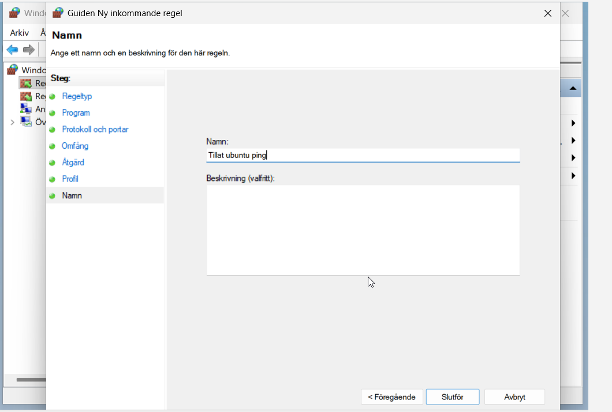

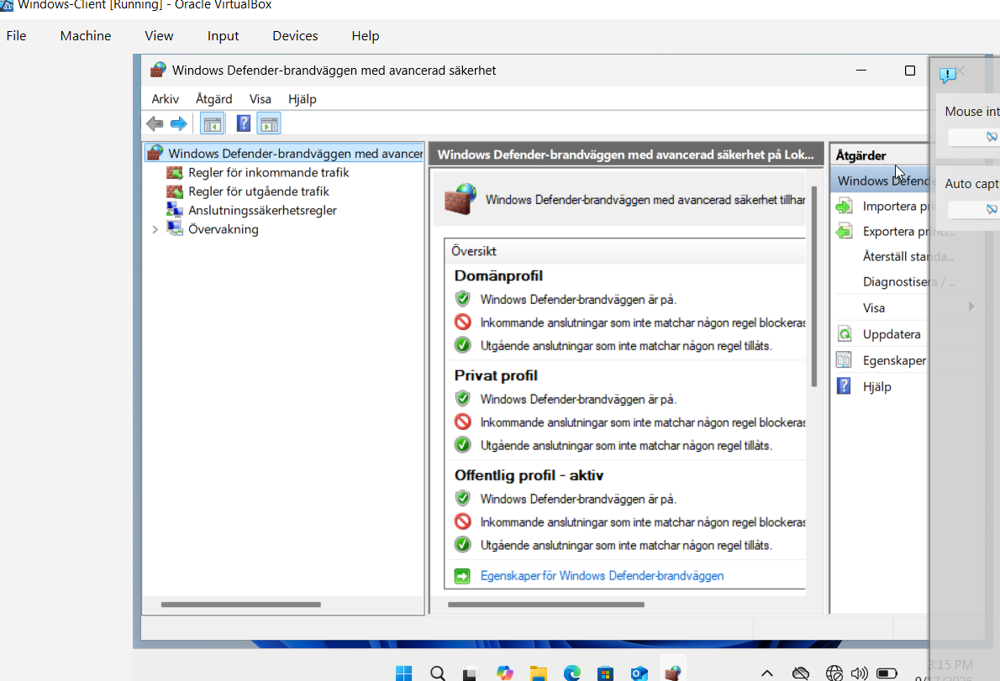

## Communication Between the Virtual Machines

The connection between the two virtual machines was tested using ping.

Ubuntu → Windows

The following command was executed on Ubuntu:

ping 192.168.10.20

The Ubuntu server received replies from the Windows client.

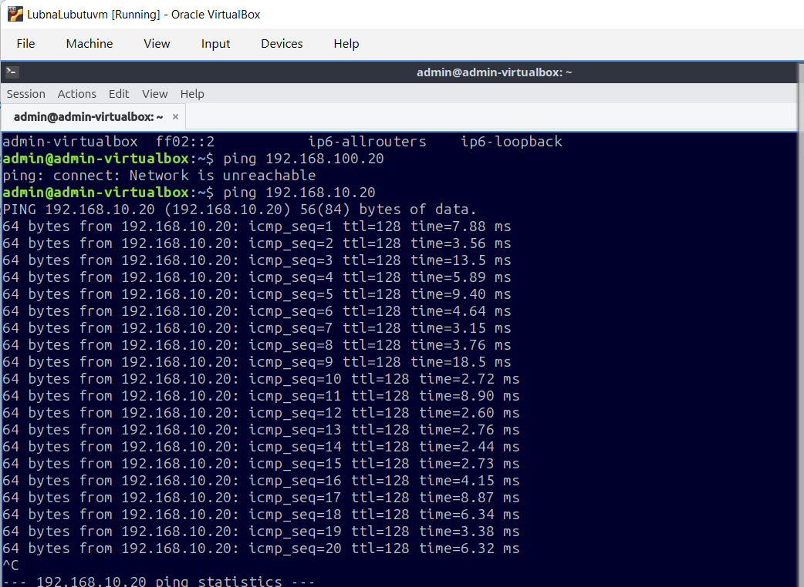

This confirms that the Ubuntu server can communicate with the Windows client over the internal network.

## Windows → Ubuntu

The following command was executed on Windows:

ping 192.168.10.10

The Windows client received replies from the Ubuntu server.

This confirms that communication works in both directions.

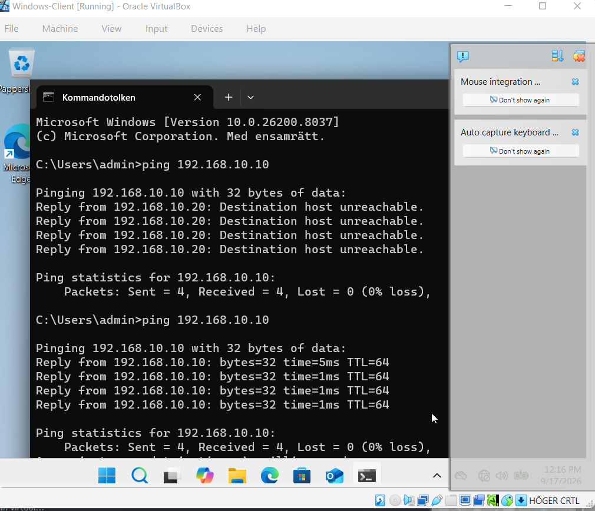

## Result

The two virtual machines were successfully configured on the same internal network.

Communication between the Ubuntu Server and Windows Client was verified using ping in both directions.

Results:

Ubuntu Server can communicate with the Windows Client.

Windows Client can communicate with the Ubuntu Server.

Both machines use the same subnet.

The Windows Firewall was configured to allow ICMPv4 Echo Requests.

The LabNetwork internal network is functioning correctly.

## 3. Command-Line Implementation and Troubleshooting

## Part 1 — Linux VM (Bash)

Open a terminal in Linux VM.

1. Create the folder and file

First create the directory:

```bash
sudo mkdir -p /var/systementor/konsultdata
```
Create the file:

```bash
sudo touch /var/systementor/konsultdata/anteckningar.txt
```
You can verify:

```bash
ls -la /var/systementor/konsultdata
```
2. Create the konsulter group

```bash
sudo groupadd konsulter
```
Check that it exists:

```bash
getent group konsulter
```
\## Assign the folder and file to the group

Change the group ownership of the directory:

```bash
sudo chgrp konsulter /var/systementor/konsultdata
```
Change the group ownership of the file:

```bash
sudo chgrp konsulter /var/systementor/konsultdata/anteckningar.txt
```
Now set the permissions.

For the directory:

```bash
sudo chmod 750 /var/systementor/konsultdata
```
For the file:

```bash
sudo chmod 640 /var/systementor/konsultdata/anteckningar.txt
```
What does 750 mean?

7 = owner: read + write + execute

5 = group: read + execute

0 = others: no permissions

So:

```text
750
│││
││└── Others: no access
│└─── Group: read + execute
└──── Owner: read + write + execute
```

For the file, 640 means:

6 = owner: read + write

4 = group: read

0 = others: no access

This follows the Least Privilege principle because users who are not the owner or members of konsulter have no access.

4. Verified permissions

```bash
ls -ld /var/systementor/konsultdata
```
```bash
ls -la /var/systementor/konsultdata
```
### 3.2 Windows - PowerShell

Powershell was open using run as administrator.

```powershell
New-Item -Path "C:\Systementor\KonsultData" -ItemType Directory -Force
```
then inspect the acl 

```powershell
New-Item -Path "C:\Systementor\KonsultData" -ItemType Directory -Force
```
to get a more useful view of the permissions need to write this command:

```powershell
(Get-Acl "C:\Systementor\KonsultData").Access
```
after that ping each vm and Successful replies demonstrate that Windows can communicate with Linux and Linux can communicate with windows.

## problems

when I wrote sudo chgrp konsulter /var/systementor/konsultdata/anteckningar.txt after this it says chgrp: cannot dereference . after fixing I had another error "ls: cannot open directory permision denied". Which means the directory permissions are now preventing my current user from entering/listing the directory. This is likely because I set the directory to 750, and user is neither the owner nor a member of konsulter. so tried to inspect it 

```bash
sudo ls -la /var/systementor/konsultdata
```
Then check the directory permissions:

```bash
ls -ld /var/systementor/konsultdata
```
then added the user to konsulter group

first need to find username

```bash
whoami
```
and then change it

```bash
sudo usermod -aG konsulter admin
```
Then log out and log back in (or restart the terminal/session), and check:

```bash
groups
```
Then 

```bash
ls -la /var/systementor/konsultdata
```
again the permission was denied

the problem was konsulter group is correct, but the directory has the wrong permissions. then it was fix 

Fix it

Run exactly:

```bash
sudo chmod 750 /var/systementor/konsultdata
```
Then check:

```bash
ls -ld /var/systementor/konsultdata
```
Then check the file

Run:

```bash
ls -l /var/systementor/konsultdata/anteckningar.txt
```
Finally, check the whole assignment

Run:

```bash
ls -la /var/systementor/konsultdata
```
```
3. Network

```powershell
ipconfig /all
```
Test-Connection \<LINUX-IP>

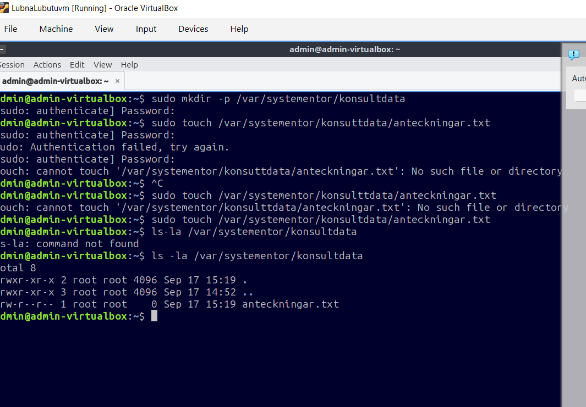

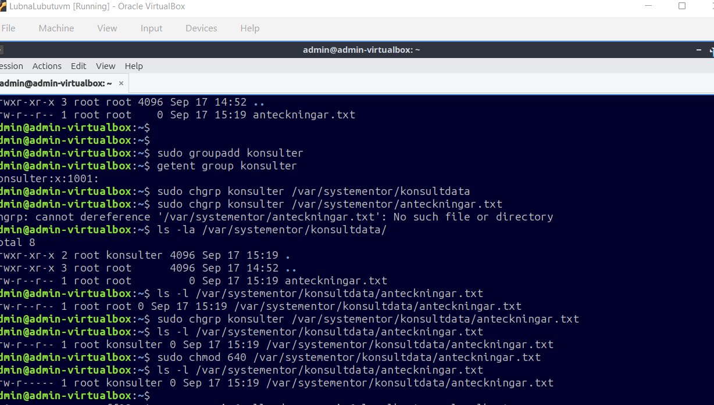

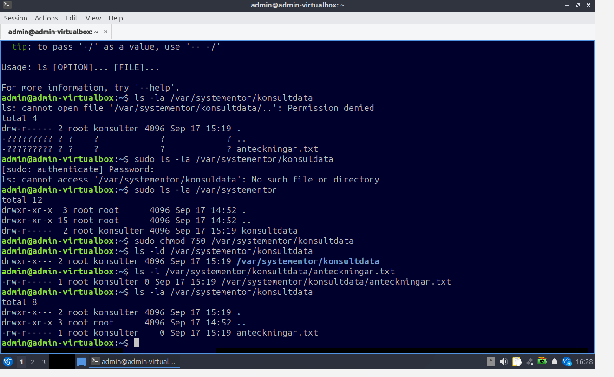

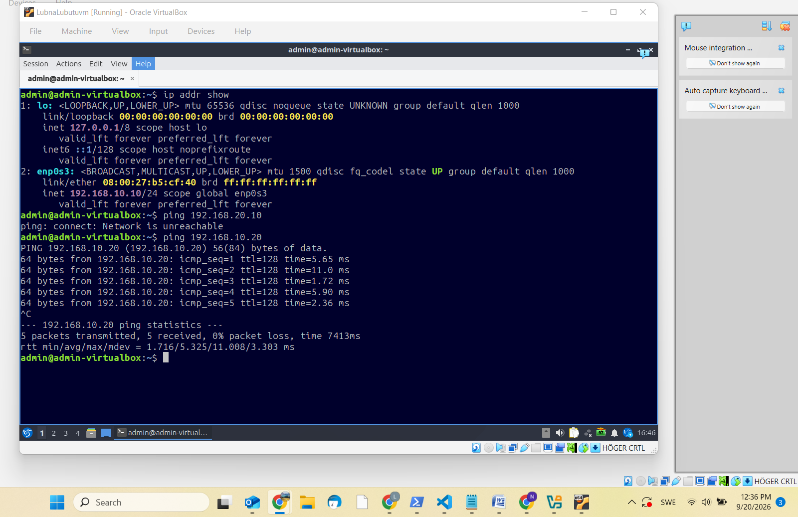

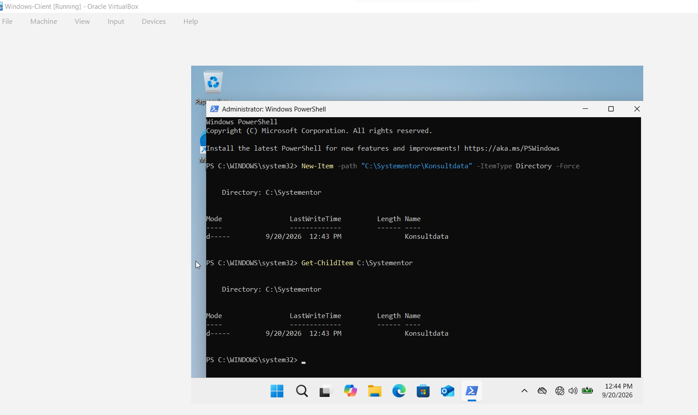

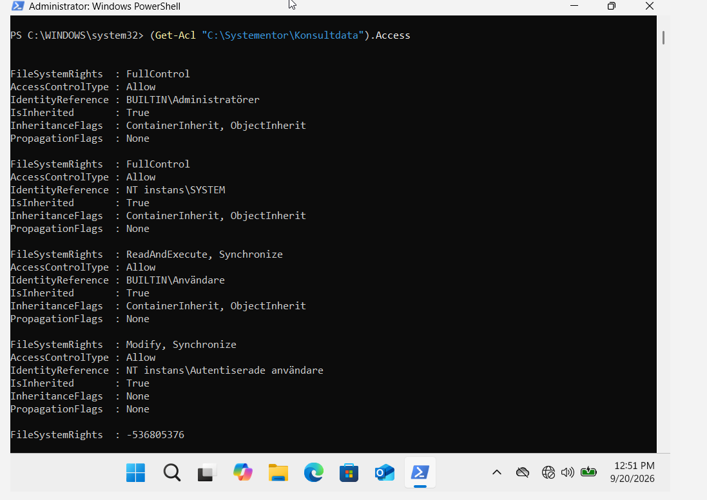

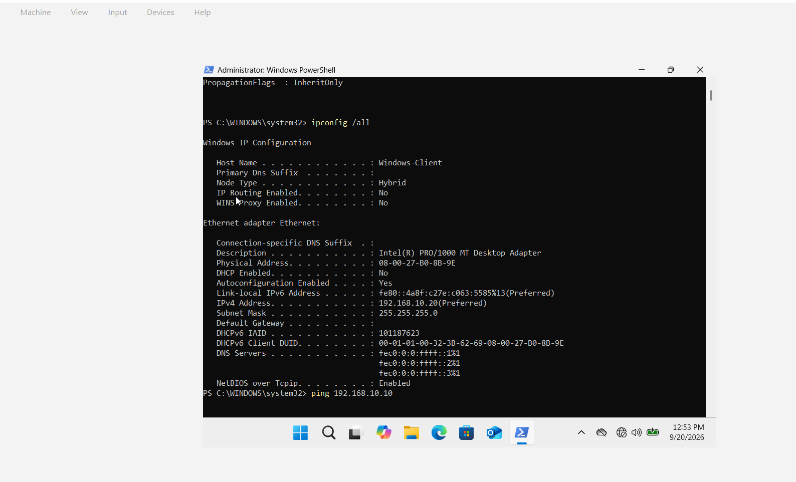

## 4. Git and Version Control

## 5. AI Log and Critical Evaluation

